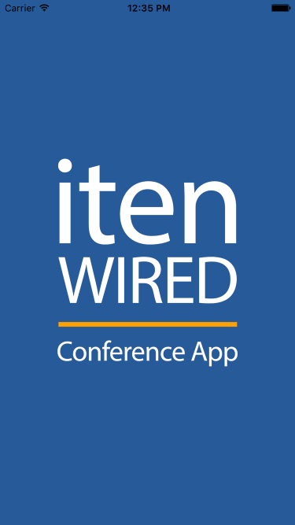
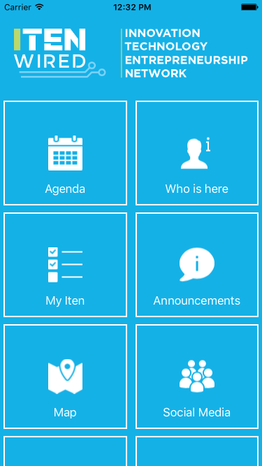

# iTenWired Conference App - Swift
> New Version of the iTenWired Conference App for iOS.

[![Swift Version][swift-image]][swift-url]
[![License][license-image]][license-url]
[](http://cocoapods.org/pods/LFAlertController)

An app for ITEN Wired attendees to view information about an annual technology summit in Pensacola, FL. The App displays detailed Schedule with information on Speakers, Presentations and Exhibitors. Users can post social media updates, build a custom schedule and get driving directions.





## Features

- [x] Agenda
- [x] Who is here
- [x] My Iten
- [x] Announcements
- [x] Map
- [x] Social Media
- [x] Live Broadcast
- [x] Near me - (iBeacons)
- [x] About

## Requirements

- iOS 8.0+
- Xcode 7.3

## Installation

#### Manually
1. Download and open the ```Conference App.xcworkspace```  
2. Congratulations!  


## Contribute

We would love for you to contribute to **iTenWired Conference App**, check the ``LICENSE`` file for more info.

## Meta

Janusz Chudzynski –  janusz@izotx.com – [www.izotx.com](http://www.izotx.com)

Felipe N. Brito - me@felipenbrito.com - [www.felipenbrito.com](http://www.felipenbrito.com)

Distributed under the XYZ license. See ``LICENSE`` for more information.

The project icons were provided by [icons8.com](https://icons8.com)

## License

<a rel="license" href="http://creativecommons.org/licenses/by-nc/4.0/"></a><br />This work is licensed under a <a rel="license" href="http://creativecommons.org/licenses/by-nc/4.0/">Creative Commons Attribution-NonCommercial 4.0 International License</a>.

For commercial usage please contact Janusz Chudzynski at janusz@izotx.com


[swift-image]:https://img.shields.io/badge/swift-2.0-orange.svg
[swift-url]: https://swift.org/
[license-image]: https://img.shields.io/badge/LICENSE-CC%20BY--NC%204.0-blue.svg
[license-url]: http://creativecommons.org/licenses/by-nc/4.0/"

